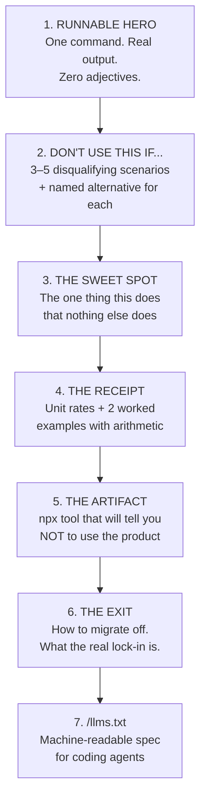

# The Google Cloud Developer-First Rewrite Playbook

> **Thesis:** Cloud marketing pages are written for procurement committees, but the purchase decision is now made by an engineer in a terminal (or increasingly, by an AI agent reading docs on that engineer's behalf). This playbook rewrites Google Cloud product pages for that audience.

**Pilot products chosen:** `Cloud Run` (compute) and `Cloud Spanner` (database) — the two highest-leverage rewrites in the portfolio. Supporting sketches for `GKE` and `BigQuery` included.

---

## Part 0: The 4 Methods (and the 5th)

| # | Method | Core Question It Answers | Failure Mode Today |
| :--- | :--- | :--- | :--- |
| 1 | **Flaw-First Anti-Pitch** | "When should I *not* use this?" | Every product claims to be right for every workload |
| 2 | **Zero-Fluff Receipts** | "What will this actually cost me?" | Pricing hidden behind a 12-field calculator and a sales call |
| 3 | **Dual-Audience / AEO** | "Can my coding agent read this?" | Docs are JS-rendered sidebars that LLMs can't parse |
| 4 | **Engineering-as-Marketing** | "Can I verify this claim myself?" | Claims are unverifiable marketing assertions |
| 5 | **Migration Honesty** *(bonus)* | "How do I get out if this goes wrong?" | Exit paths are never mentioned — the #1 unspoken adoption blocker |

> [!IMPORTANT]
> Method 5 (Migration Honesty) is the one nobody does, and it is disproportionately effective for databases. A developer choosing Spanner is making a 5-year bet. Telling them exactly how to leave is the strongest possible signal that you expect them to stay.

---

## Part 1: Cloud Run — Complete Rewrite

### 1.1 Before / After: The Hero

```diff
- Cloud Run
- Build and deploy scalable containerized apps written in any
- language (including Go, Python, Java, Node.js, .NET, and Ruby)
- on a fully managed platform. Empower your developers to focus
- on writing code with a seamless developer experience.
- [ Try it free ]  [ Contact sales ]

+ # Cloud Run
+ > Any container. Real concurrency. Scale to zero. No Kubernetes tax.
+
+ ```bash
+ gcloud run deploy my-api --source . --allow-unauthenticated
+ # → https://my-api-abc123-uc.a.run.app  (HTTPS, autoscaled, ~45s)
+ ```
+
+ No Dockerfile required. No YAML. No cluster. No load balancer to configure.
```

**Why this works:** The old hero spends 40 words listing languages (developers assume container = any language) and 15 words on "empower." The new hero is a command you can paste into a terminal in the next 3 seconds.

---

### 1.2 Method 1 — The Anti-Pitch Section

> Placed **above the fold on the second scroll** — before features, not buried in a comparison doc.

```markdown
## 🚫 Don't Use Cloud Run If...

We'd rather you pick the right tool than get burned six months in.

### ❌ You need persistent local disk state
Instances are ephemeral. When an instance scales down — which it will,
often, without warning — anything written to the local filesystem is gone.
**Use instead:** Cloud SQL, Firestore, or GCS with a mounted volume.

### ❌ Your traffic is flat and predictable 24/7
If your CPU sits near 100% around the clock, you're paying serverless
prices for non-serverless usage patterns.

| Workload: 4 vCPU, 16GB, 730 hrs/month, always on |  Monthly |
| :--- | ---: |
| Cloud Run (min-instances=4, always allocated) | ~$285 |
| Compute Engine e2-standard-4 (1yr CUD) | ~$97 |
| GKE Autopilot (equivalent pods) | ~$175 |

**Use instead:** Compute Engine with a committed use discount.
**Cloud Run wins when** traffic is bursty, daytime-only, or drops to zero.

### ❌ You're holding tens of thousands of idle WebSockets
WebSockets work (60-min request timeout), but you're billed for container
time while connections are open — even when idle. 20,000 mostly-idle
sockets is an expensive way to rent RAM.
**Use instead:** Compute Engine, or a Pub/Sub + push architecture.

### ❌ You need sub-5ms p99 cold-start-free latency at zero cost
`--min-instances 1` eliminates cold starts, but you then pay for an
always-on instance. There is no free lunch here and we won't pretend there is.

### ❌ You need GPUs for large-scale distributed training
Cloud Run GPU support exists for inference. Multi-node distributed training
with NCCL and InfiniBand is a GKE problem.
```

---

### 1.3 Method 2 — The Transparent Receipt

```markdown
## 💰 What This Actually Costs

Billed per 100ms, only while a request is being processed.

| Resource | Rate |
| :--- | :--- |
| vCPU | $0.000024 / vCPU-second ($0.086 / core-hour) |
| Memory | $0.0000025 / GiB-second |
| Requests | $0.40 per 1M requests |
| **Free tier (monthly, forever)** | **2M requests + 180,000 vCPU-s + 360,000 GiB-s** |

### Worked Example A: Side-project API
100,000 requests/day · 80ms avg latency · 1 vCPU / 512MB

$$\text{vCPU-s/month} = 100{,}000 \times 30 \times 0.08 = 240{,}000$$

Minus the 180,000 free → 60,000 billable vCPU-s → **$1.44**
Requests: 3M − 2M free = 1M → **$0.40**
### **Total: $1.84/month**

### Worked Example B: Production SaaS
5M requests/day · 120ms avg · 2 vCPU / 2GB · min-instances=2

| Line item | Amount |
| :--- | ---: |
| Active compute (2 vCPU × 18M vCPU-s) | $432.00 |
| Memory (2 GiB × 18M GiB-s) | $90.00 |
| Idle min-instances (2 × 730h, idle rate) | $37.00 |
| Requests (150M) | $60.00 |
| **Total** | **~$619/month** |

Verify it yourself: `npx gcp-run-calc --rps 58 --latency 120 --cpu 2`
```

> [!TIP]
> Every number above is arithmetic the reader can redo. That is the entire point. A pricing page that can be independently verified is worth more than a pricing page that is merely *low*.

---

### 1.4 Method 3 — The Concurrency Proof (the real differentiator)

```markdown
## ⚡ Concurrency: The Reason Lambda Users Switch

AWS Lambda gives one request one execution environment.
Cloud Run gives one *container* up to 1,000 concurrent requests.

              80 simultaneous requests arrive
                          │
  ┌───────────────────────┴───────────────────────┐
  │  AWS Lambda            │  Cloud Run           │
  │  ────────────          │  ─────────           │
  │  80 × cold starts      │  1 container         │
  │  80 × billed runtimes  │  1 billed runtime    │
  │  80 × DB connections   │  1 connection pool   │
  └────────────────────────┴──────────────────────┘

That third row is the one that bites people in production. Eighty Lambda
invocations open eighty database connections and exhaust your Postgres
`max_connections`. One Cloud Run container shares one pool.

```bash
# Tune it explicitly:
gcloud run deploy api --concurrency 80   # default
gcloud run deploy api --concurrency 1    # Lambda-style isolation
gcloud run deploy api --concurrency 1000 # max, for I/O-bound services
```
```

---

### 1.5 Method 4 — Engineering-as-Marketing Artifact

**Ship:** `npx gcp-run-calc` — a zero-dependency CLI.

```bash
$ npx gcp-run-calc --rps 58 --latency 120 --cpu 2 --memory 2 --min-instances 2

⚡ Cloud Run Cost & Architecture Fit

  Your workload: 58 RPS sustained, 120ms p50, 2 vCPU / 2GiB

  Cloud Run                                          $619/mo
  GKE Autopilot (equivalent)                         $494/mo
  Compute Engine e2-standard-4 ×2 (1yr CUD)          $194/mo

  ⚠️  FIT WARNING: Your traffic is sustained (58 RPS, low variance).
      Cloud Run's scale-to-zero advantage is unused here.
      At this profile, Compute Engine is 3.2x cheaper.

  ✅ Cloud Run becomes the cheaper option below ~18 RPS sustained,
     or if your traffic drops to zero for >9 hours/day.

  Concurrency check: at 58 RPS × 0.12s = 7 in-flight requests.
  → 1 container at --concurrency 80 handles this. You're over-provisioned
    with min-instances=2. Try --min-instances 1.
```

> [!NOTE]
> The tool recommending **against** Cloud Run in the output is the feature, not a bug. It is the single highest-trust move available, and it is exactly what `swe-cost-estimator` did to earn credibility.

---

### 1.6 Method 3 (AEO) — `cloud.google.com/run/llms.txt`

```markdown
# Cloud Run

> Serverless container runtime. Request-driven autoscaling from 0 to N.
> Billed per 100ms of request processing time.

## Deploy
gcloud run deploy SERVICE --source . --region REGION --allow-unauthenticated

## Container contract
- MUST listen on $PORT (default 8080), on 0.0.0.0, not localhost
- MUST be stateless; local disk is ephemeral tmpfs (counts against memory)
- MUST start and accept traffic within 240s (configurable)
- Linux/amd64 or linux/arm64

## Key flags
--concurrency N        1–1000, default 80. Requests per container.
--min-instances N      Warm instances. >0 eliminates cold starts, costs idle.
--max-instances N      Default 100. Hard ceiling; protects downstream DBs.
--cpu N                1, 2, 4, 8. Fractional (0.08–1) allowed if concurrency=1.
--memory Mi|Gi         128Mi–32Gi. Must be ≥ 512Mi if cpu ≥ 1.
--timeout Ns           Max 3600s (60 min).
--cpu-boost            2x CPU during startup. Reduces cold start ~40%.
--no-cpu-throttling    CPU allocated outside requests. For background work.

## Do not use for
- Stateful workloads requiring durable local disk
- Flat 24/7 100% CPU (Compute Engine CUD is ~3x cheaper)
- Large idle WebSocket fleets
- Multi-node distributed GPU training (use GKE)

## Common errors
"Container failed to start"  → not listening on $PORT, or bound to 127.0.0.1
"The request was aborted"    → exceeded --timeout
"429 Too Many Requests"      → hit --max-instances ceiling
Connection pool exhaustion   → set --max-instances below DB max_connections
```

---

## Part 2: Cloud Spanner — Complete Rewrite

> Spanner is the hardest rewrite in the portfolio and therefore the most valuable. It is a genuinely extraordinary piece of engineering that developers actively avoid, because the marketing leads with "Google-scale" (intimidating) and the pricing historically started at ~$650/month (disqualifying). Both of those framings are now out of date, and nobody knows it.

### 2.1 Before / After: The Hero

```diff
- Cloud Spanner
- Fully managed relational database with unlimited scale, strong
- consistency, and up to 99.999% availability. Spanner is the only
- enterprise-grade, globally-distributed, and strongly consistent
- database service built for the cloud.
- [ Contact sales ]

+ # Cloud Spanner
+ > PostgreSQL wire protocol. Strongly consistent across continents.
+ > No shards, no read replicas to reason about, no failover runbook.
+ > Starts at ~$65/month.
+
+ ```bash
+ gcloud spanner instances create prod \
+   --config=regional-us-central1 \
+   --processing-units=100 \
+   --description="prod"
+
+ psql "host=... dbname=app"   # yes, actual psql
+ ```
+
+ The $650/month entry price you remember was retired.
+ 100 processing units (1/10th of a node) is the new floor.
```

**Why this works:** Three specific objections killed on sight — *"it's not Postgres"* (it speaks the wire protocol), *"it's too expensive"* (here's the real floor), *"it's for Google-scale only"* (here's a 100 PU dev instance).

---

### 2.2 Method 1 — The Anti-Pitch

```markdown
## 🚫 Don't Use Spanner If...

Spanner solves a specific, expensive problem. If you don't have that
problem, it is the wrong database and you will resent paying for it.

### ❌ Your data fits on one machine and always will
Under ~500GB, single-region, <5,000 QPS? Cloud SQL for PostgreSQL costs a
fraction and gives you the full Postgres extension ecosystem.
**Use instead:** Cloud SQL, or AlloyDB if you need more headroom.

### ❌ You depend on the PostgreSQL extension ecosystem
No PostGIS. No pg_vector. No pg_cron. No custom C extensions.
Spanner's PostgreSQL interface covers the wire protocol and core SQL —
not the extension surface. If your app is built on PostGIS, stop here.
**Use instead:** Cloud SQL or AlloyDB.

### ❌ You need sub-millisecond single-row reads
Spanner's strong consistency has a floor: reads involve a Paxos quorum.
Expect ~5–10ms p50 for a single-region read, not the ~0.5ms you'd get
from a warm local Postgres page cache or Redis.
**Use instead:** Memorystore/Redis in front, or Bigtable for KV.

### ❌ You're doing heavy analytical scans and aggregations
Spanner is OLTP. A `GROUP BY` over 2 billion rows will work and will be
slow and will be expensive.
**Use instead:** BigQuery. (Spanner has zero-ETL federation into BigQuery —
you can have both without a pipeline.)

### ❌ You want to hand-tune the query planner
No `pg_hint_plan`, limited plan forcing, no manual index hints in the
Postgres dialect. You are trusting Spanner's planner. Most of the time
that's fine. When it isn't, your escape hatches are narrower than Postgres.

### ❌ You need a cheap dev/test environment that behaves like prod
Use the **Spanner Emulator** (free, local, Docker) for dev — but know it
does not reproduce production latency, hotspotting, or split behavior.
Load-test against a real instance before you trust your capacity model.
```

---

### 2.3 Method 2 — The Receipt (where Spanner has been most misunderstood)

```markdown
## 💰 What Spanner Actually Costs in 2026

Pricing is per **processing unit (PU)**. 1,000 PU = 1 node.
The old "1 node minimum" floor is gone; 100 PU is the minimum.

| Resource | Regional | Multi-region |
| :--- | ---: | ---: |
| 100 PU (1/10 node) | ~$65/mo | ~$195/mo |
| 1,000 PU (1 node) | ~$650/mo | ~$1,950/mo |
| Storage | $0.30/GB-mo | $0.50/GB-mo |
| Backup storage | $0.10/GB-mo | $0.10/GB-mo |
| Network egress (same region) | Free | — |

### Worked Example A: Early-stage startup, single region
100 PU · 50GB data · ~1,500 QPS peak

| Line item | Amount |
| :--- | ---: |
| 100 processing units | $65.00 |
| Storage (50GB × $0.30) | $15.00 |
| Backups (50GB × $0.10) | $5.00 |
| **Total** | **~$85/month** |

Compare: Cloud SQL `db-custom-4-16384` + HA + 50GB ≈ **$420/month**.

> Yes — read that again. At small scale with HA enabled, Spanner can be
> *cheaper* than a highly-available Cloud SQL instance, because you're not
> paying for a hot standby that does nothing.

### Worked Example B: Global multi-region, 3 continents
3,000 PU multi-region (nam-eur-asia1) · 2TB · ~40,000 QPS

| Line item | Amount |
| :--- | ---: |
| 3,000 PU multi-region | $5,850.00 |
| Storage (2TB × $0.50) | $1,024.00 |
| Backups | $205.00 |
| **Total** | **~$7,079/month** |

**The honest comparison:** self-managing a 3-region Postgres with Citus or
Vitess, plus the SRE headcount to run failover drills and resharding, is
not cheaper. It's 1.5–3 engineers. Budget accordingly in both directions.

### The autoscaler changes the math
```bash
gcloud spanner instances update prod \
  --autoscaling-min-processing-units=100 \
  --autoscaling-max-processing-units=2000 \
  --autoscaling-high-priority-cpu-target=65
```
If your load is diurnal, you are billed for the curve, not the peak.
```

---

### 2.4 Method 5 — Migration Honesty (the trust unlock for databases)

```markdown
## 🚪 How To Leave Spanner

Nobody puts this on a database landing page. We're putting it here because
you're evaluating a multi-year commitment and you deserve to know the exit.

**The honest summary:** getting *in* is easy, getting *out* is real work.

### What travels with you
- Your schema (PostgreSQL dialect → standard Postgres DDL, mostly 1:1)
- Your data (`gcloud spanner databases export` → Avro in GCS → `COPY`)
- Your application SQL, if you stayed on the PG interface and avoided
  Spanner-specific constructs

### What does not travel
| Spanner feature | Postgres equivalent | Rewrite cost |
| :--- | :--- | :--- |
| Interleaved tables | Foreign keys + manual co-location | Medium — schema redesign |
| `commit_timestamp` columns | Trigger or app-level | Low |
| Change streams | Debezium / logical replication | Medium |
| Multi-region strong consistency | *No equivalent.* Pick a primary. | **This is the real lock-in** |
| Automatic resharding | Citus/Vitess + an SRE | High |

### The lock-in, stated plainly
If you build an application that genuinely depends on strongly consistent
writes across three continents, there are perhaps two other systems on
Earth that will do that, and moving to them is a rearchitecture, not a
migration. **That is a real lock-in and you should price it into the decision.**

If instead you use Spanner as "managed Postgres that never needs a
resharding project," your exit is a weekend of export/import plus a
schema review. Choose which one you're signing up for, deliberately.
```

> [!IMPORTANT]
> This section will be the most-quoted part of the page. Publishing the lock-in analysis before a competitor writes it for you converts your biggest objection into your biggest credibility asset.

---

### 2.5 Method 4 — Engineering-as-Marketing Artifacts

**Artifact 1 — `npx spanner-fit`** — answers "should I even be here?"

```bash
$ npx spanner-fit --rows 40000000 --regions 1 --qps 1500 --growth 2.5x-yearly

🔍 Spanner Fit Analysis

  Data:      40M rows / ~48GB      Regions: 1 (us-central1)
  Peak QPS:  1,500                 Growth:  2.5x/yr

  ❌ SPANNER IS NOT RECOMMENDED — YET

  At 48GB / 1,500 QPS / single-region, Cloud SQL for PostgreSQL handles
  this comfortably and costs less:

     Cloud SQL (db-custom-4-16384, HA)          $418/mo
     AlloyDB (2 vCPU primary + 1 replica)       $383/mo
     Spanner (100 PU + 48GB)                     $84/mo  ← cheaper, but
                                                            you lose pg
                                                            extensions

  💡 THE REAL DECISION: at this size it's about extensions, not scale.
     Using PostGIS / pg_vector / pg_cron?  → Cloud SQL or AlloyDB.
     Plain relational SQL + HA + no ops?   → Spanner at 100 PU is fine
                                              and 5x cheaper than Cloud SQL HA.

  📈 Your 2.5x/yr growth crosses the Cloud SQL single-writer ceiling
     (~8,000 write QPS) in approximately 19 months. Revisit then, or
     start on Spanner now to avoid the migration.
```

**Artifact 2 — Local emulator, one command:**

```bash
docker run -p 9010:9010 gcr.io/cloud-spanner-emulator/emulator
export SPANNER_EMULATOR_HOST=localhost:9010
# free, offline, no GCP project required
```

---

### 2.6 `cloud.google.com/spanner/llms.txt`

```markdown
# Cloud Spanner

> Horizontally-scaling relational database. Strong external consistency
> via TrueTime. PostgreSQL wire-compatible interface or GoogleSQL dialect.
> Billed per processing unit (1000 PU = 1 node), minimum 100 PU.

## Create
gcloud spanner instances create NAME --config=regional-us-central1 \
  --processing-units=100
gcloud spanner databases create DB --instance=NAME --database-dialect=POSTGRESQL

## Connect (PostgreSQL dialect)
Standard pg wire protocol via PGAdapter. psql, pgx, SQLAlchemy, Prisma work.

## Supported
- SQL:2011 core, JOINs, subqueries, CTEs, window functions
- Transactions: read-write (locking), read-only (lock-free, stale or strong)
- Secondary indexes, including STORING clauses (covering indexes)
- Interleaved tables (parent-child physical co-location)
- Change streams, zero-ETL BigQuery federation
- JSONB, ARRAY, NUMERIC, generated columns

## NOT supported
- PostgreSQL extensions (PostGIS, pg_vector, pg_cron, pg_hint_plan)
- Stored procedures / user-defined functions in PL/pgSQL
- Manual query plan hints (Postgres dialect)
- Cross-database joins within an instance
- SERIAL / auto-increment → use UUID or bit-reversed sequences

## Schema rules that matter
- PRIMARY KEY is mandatory and immutable
- Monotonic keys (timestamps, sequences) CAUSE HOTSPOTS → use UUIDv4 or
  bit_reversed_positive sequences
- Max 10MB per row (incl. indexes)
- Interleave child tables under parents for co-located access

## Do not use for
- <500GB single-region workloads (Cloud SQL is cheaper/simpler)
- Apps depending on pg extensions
- Sub-millisecond single-row reads (quorum floor ~5ms)
- Analytical scans (use BigQuery federation)

## Local development
docker run -p 9010:9010 gcr.io/cloud-spanner-emulator/emulator
export SPANNER_EMULATOR_HOST=localhost:9010
```

---

## Part 3: Supporting Sketches

### 3.1 GKE — the anti-pitch writes itself

```markdown
# Google Kubernetes Engine
> Kubernetes, operated by the team that wrote Kubernetes.

## 🚫 Don't Use GKE If...

### ❌ You have fewer than 5 engineers and no platform owner
You will spend 30–40% of engineering cycles on YAML, Ingress, IAM
bindings, Helm drift, and upgrade windows. That is a real cost and it is
paid in features you didn't ship.
**Use instead:** Cloud Run. You can migrate to GKE later; the container
is the same artifact.

### ❌ You just need to run a web service
Cloud Run does this in one command with no cluster to maintain.

### ✅ Use GKE when you have:
Sidecars · DaemonSets · service mesh · multi-tenant namespaces ·
GPU/TPU scheduling · operators & CRDs · hybrid or multi-cloud ·
workloads that must not be request-driven
```

**Receipt to publish:** the honest TCO table.

| | Cloud Run | GKE Autopilot | GKE Standard |
| :--- | ---: | ---: | ---: |
| Cluster management fee | $0 | $0.10/hr (~$73/mo) | $0.10/hr (~$73/mo) |
| Compute (4 vCPU/16GB equiv) | ~$285/mo | ~$175/mo | ~$97/mo (CUD) |
| **Engineer-hours/month** | **~2** | **~12** | **~40** |
| **Loaded cost @ $120/hr** | **+$240** | **+$1,440** | **+$4,800** |
| **True TCO** | **~$525** | **~$1,688** | **~$4,970** |

> Publishing engineer-hours as a line item is the entire trick. It is the number every engineering manager is already computing privately.

---

### 3.2 BigQuery — pricing honesty is the whole product

```markdown
# BigQuery

## 🚫 Don't Use BigQuery If...
### ❌ You need to look up a row by key in <100ms → Bigtable / Firestore
### ❌ You need row-level UPDATE/DELETE at OLTP rates → Cloud SQL / Spanner
### ❌ You have <100GB and one analyst → Postgres with an index is fine
### ❌ You run unbounded `SELECT *` in a BI tool all day → see below ⚠️

## ⚠️ The $10,000 Mistake We Should Warn You About
On-demand pricing is $6.25/TiB **scanned**, not returned.

  SELECT * FROM events WHERE user_id = 'abc'   -- scans the whole table
  -- 40TB table → $250. Per query. A dashboard refreshing every 5 min
  -- costs $72,000/month.

  Fix it:
  1. PARTITION BY DATE(event_time)     → scan 1 day, not 5 years
  2. CLUSTER BY user_id                → prune blocks within the partition
  3. Never SELECT *                    → columnar storage; pick columns
  4. Set a custom quota                → hard ceiling, per project/user

  Same query, partitioned + clustered + 3 columns:  $0.02

We put this warning on the landing page because we'd rather you succeed
than get a surprise invoice and churn.
```

---

## Part 4: The Reusable Template

Every Google Cloud product page follows this structure. No exceptions.



### Section-by-section rules

| Section | Hard rule | Anti-pattern to delete |
| :--- | :--- | :--- |
| 1. Hero | ≤ 20 words + one runnable command | "empower", "seamless", "unlock", "any workload" |
| 2. Anti-pitch | ≥ 3 disqualifiers, each naming a competitor or sibling product | "not recommended for some use cases" |
| 3. Sweet spot | One claim, with the mechanism explained | Feature bullet lists |
| 4. Receipt | Arithmetic the reader can redo | "Contact sales for pricing" |
| 5. Artifact | Must be able to output "don't use this" | Gated calculators, lead-capture forms |
| 6. Exit | Name the lock-in explicitly | Silence |
| 7. llms.txt | Plain markdown, includes "do not use for" | JS-rendered docs |

---

## Part 5: How You'd Actually Land This

### Phase 1 — Prove it on one page (4 weeks)
1. Rewrite **Cloud Run** only. One page, full 7-section treatment.
2. Ship `npx gcp-run-calc` to npm. Open-source, MIT, no telemetry.
3. Publish `cloud.google.com/run/llms.txt`.
4. A/B against the current page.

### Phase 2 — Prove it generalizes (8 weeks)
5. **Spanner** — the hard case. If the anti-pitch works on a database with a
   $650/mo reputation and real lock-in, it works anywhere.
6. Ship `npx spanner-fit`.
7. Publish the Spanner exit-path doc. Expect it to get quoted widely.

### Phase 3 — Systematize (ongoing)
8. Template + linter in the docs CI: fail the build on banned adjectives
   ("seamless", "empower", "unlock", "any workload", "world-class").
9. `/llms.txt` becomes a launch requirement for every product.
10. Every product ships one `npx` artifact.

### What to measure

| Metric | Why it's the right metric |
| :--- | :--- |
| **Time-to-first-deploy** (landing → running service) | The only funnel metric developers feel |
| **`npx` artifact installs/week** | Unfakeable demand signal |
| **`llms.txt` fetch volume** | Measures the agent audience nobody is instrumenting |
| **90-day retention of self-serve signups** | Anti-pitch should *lower* signups and *raise* retention |
| **Unprompted mentions in HN/Reddit threads** | Trust, measured |

> [!WARNING]
> The anti-pitch will reduce top-of-funnel signups. That is the intended effect. If leadership measures this program on raw signup volume it will be killed in month two. Get agreement up front that the metric is **90-day retention** and **time-to-first-deploy**, not signups.

---

## Part 6: The One-Paragraph Pitch (for your leadership)

> Our product pages are written to survive a procurement review, but the decision is made by an engineer with a terminal open — and increasingly by an AI agent reading our docs on that engineer's behalf. Both of those audiences reward the same thing: verifiable specificity. I want to rewrite Cloud Run and Spanner around four principles — tell developers when *not* to use us, publish the arithmetic behind the bill, ship an open-source CLI that will recommend against us when we're the wrong fit, and expose a machine-readable `/llms.txt` so coding agents can generate correct Google Cloud code by default. I've already run this experiment publicly at small scale with `swe-cost-estimator`: the tool that argued against its own conclusions was the one practitioners trusted, extended, and shared. Expect signups to dip and 90-day retention to rise.
